# Scenarios

Videos of the following scenarios can be found [here](http://bugatti.fzi.de/DeCoC-MCTS-MDN/).

## Generation

Scenarios are written using [CUE](https://cuelang.org/). From these CUE definitions the required JSON scenario files can be generated by running `python generate_scenarios.py`, this requires the CUE executable, which can be downloaded [here](https://github.com/cuelang/cue/releases).

## Validation

Scenarios can be validated after creation and before use. This can be done with: `cue vet sc01.json scenario.cue`

## Longitudinal two Vehicles

### SC00

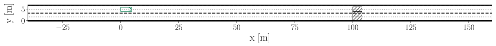  
Avoiding a collision with static obstacles

### SC01

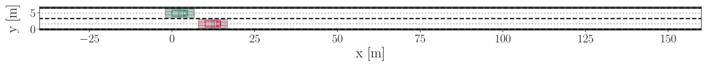  
Delaying merge due to approaching vehicle in desired lane

### SC02

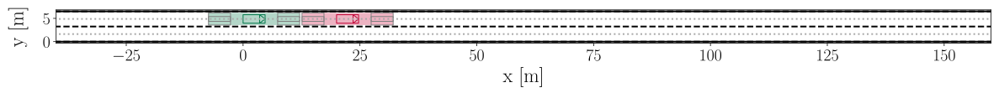  
Reacting to approaching vehicle

## Merge without Obstacles

### SC03

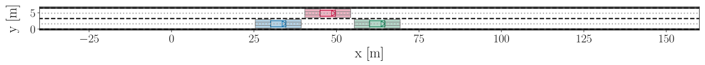  
Merging into moving traffic

### SC04

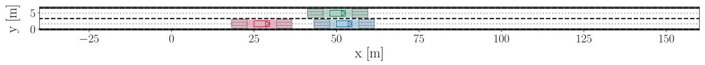  
Merging into moving traffic with prior longitudinal adjustment

## Merge with Obstacles

### SC05

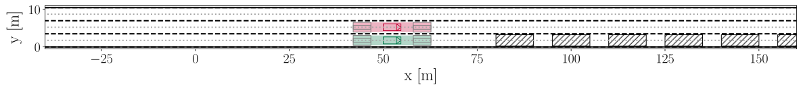  
Changing lane as other vehicle needs to merge onto lane

### SC06

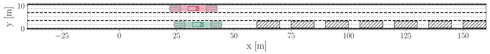  
Delaying lane change as other vehicle needs to merge first

### SC07

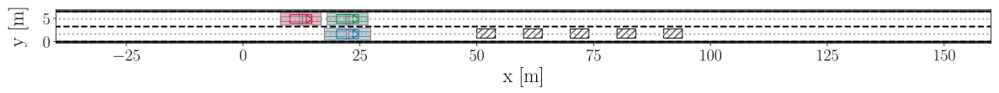  
Merging (1 vehicle) with 3 Vehicles

### SC08

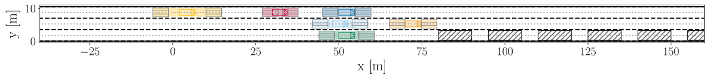  
Merging (1 vehicle) with 5 Vehicles

### SC09

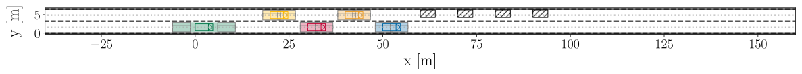  
Merging (2 vehicles) with 5 Vehicles

## Overtake

### SC11

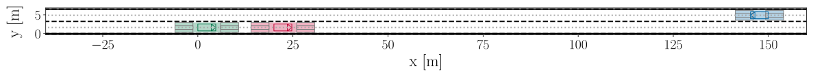  
Overtaking with oncoming traffic

## Bottleneck

### SC12

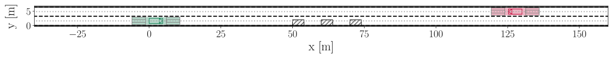  
Passing a narrow passage with oncoming traffic

### SC13

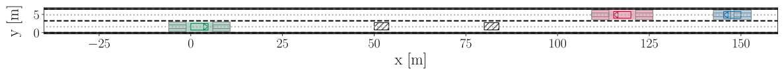  
Passing a narrow passage with a gap and oncoming traffic

### SC10

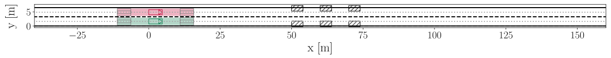  
Merging into middle lane (3 lanes)

### SC16

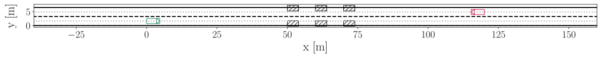  
Passing a narrow passage with oncoming traffic

## Obstacle Maze

### SC14

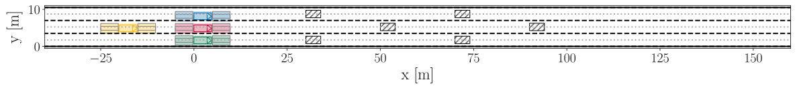  
Obstacle Maze with 4 vehicles (3 lanes)

### SC15

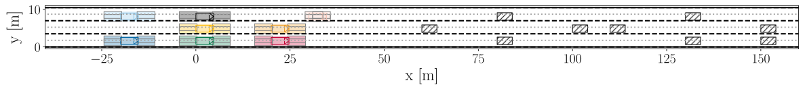  
Obstacle Maze with 8 vehicles (3 lanes)

### SC20

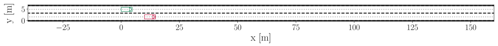  
linear reward for IRL

### SC21

  
linear cooperative reward for IRL

### SC22

  
nonlinear reward for IRL
