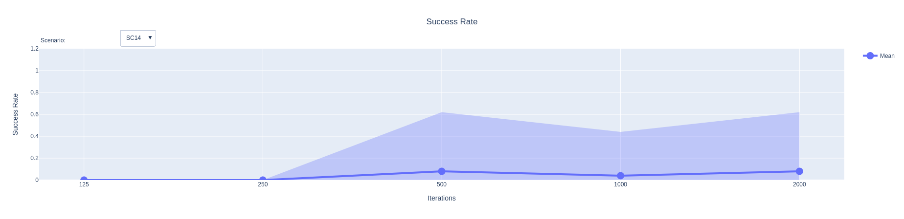

# ProSeCo Dashboard
The dashboard is an easy way to visualize data generated with the evaluator. It is based on [plotly](https://plotly.com/python/) and [dash](https://dash.plotly.com/).

## Basic usage
The dashboard can be started by running:

```bash
python index.py
```

By default it looks for evaluation runs in the `/tmp/$USER/proseco_evaluator_output` directory.
Different evaluations can be selected with the top drop-down menu.

<!-- If you want to visualize runs from a different directory you can do so by changing the following path in line 220 of `app.py`:
```python
root_evaluation_directory = get_user_temp_dir() / "proseco_evaluator_output"
``` -->

## Usage on remote machines
The dashboard should work on remote machines out of the box. Simply start it and connect to `your.remote.host.name:8050`.

## Plots and their prerequisites

You can visualize various aspects of your run. This section gives a short overview over the plots you can generate and which data is needed to draw them.
For all plots except the results summary you need to select a run from the overview table.

### Results summary


The results summary shows mean and standard deviation of all runs. Different types of outcomes are plotted:
- **carsCollided**: Collision rate.
- **carsInvalid**: Rate at which cars drive off the road.
- **desiresFulFilled**: Rate at which both agents reach their target state.
- **success**: Success rate. A run is evaluated as a success if the agents did not collide or drive off the road

It also shows a matrix plot with the mean success rate for each scenario and iteration setting.

All values are plotted for each scenario.

To be able to generate the results summary, the `"result"` export must be enabled in the output options.
<pre>
"export": [
      <b>"result"</b>,
      "childMap",
      "permutationMap",
      "moveGroups",
      "trajectory",
      "singleShot"
    ]
</pre>

Results files are exported as `result.json` for each run.

### Individual scenario results


The plot visualizes the success rate for each individual scenario with the iteration settings on the x-axis. Scenarios can be selected using the drop-down menu within the figure. 
Shaded error bands in the plot depict one standard deviation.  

To generate the results scenario success line plot, the `"result"` export must be enabled in the output options.
<pre>
"export": [
      <b>"result"</b>,
      "childMap",
      "permutationMap",
      "moveGroups",
      "trajectory",
      "singleShot"
    ]
</pre>

### Option visualization


The dashboard generates a line plot for each option choice with multiple settings in the evaluator config. Different options can be selected with the drop-down menu in the figure.

To generate the options plots, the `"result"` export must be enabled in the output options.
<pre>
"export": [
      <b>"result"</b>,
      "childMap",
      "permutationMap",
      "moveGroups",
      "trajectory",
      "singleShot"
    ]
</pre>

### Trajectory visualization


The trajectory visualization shows the trajectory of all agents plotted on a map of the scenario.
Agent trajectories are colored according to time: The later an agent was at a position, the brighter the color.

To be able to generate the trajectory visualization, the `"trajectory"` export must be enabled in the output options.
<pre>
"export": [
      "result",
      "childMap",
      "permutationMap",
      "moveGroups",
      <b>"trajectory"</b>,
      "singleShot"
    ]
</pre>

The exported trajectory is in a file named `trajectory_annotated.msgpack` or `trajectory_annotated.json`.

### Scenario video


The dashboard can create a video of a run using the `ScenarioVideoVisualizer` class from the `visualization` module.

To generate a video, the `"trajectory"` export must be enabled in the output options.
<pre>
"export": [
      "result",
      "childMap",
      "permutationMap",
      "moveGroups",
      <b>"trajectory"</b>,
      "singleShot"
    ]
</pre>

### Action class statistics


**Visitation count bar plot**


**UCT value box plot**


**Action value box plot**

Various statistics of the semantic action groups can be visualized. These include:
- **Visitation counts**: How often an action from this class has been sampled.
- **UCT values**: Box plot of the UCT value of all actions in the action class.
- **Action values**: Box plot of the action value for all actions in the action class.

For box plots, the box ranges from the 25th percentile (Q1) to the 75th percentile (Q3) (called interquartile range (IQR)). 
The line in the box visualizes the median. The low end of the bar is calculated as $Q1 - 1.5 \cdot IQR$, the upper end as $Q1 + 1.5 \cdot IQR$.

To be able to generate plots for the action class statistics, the `"childMap"` export must be enabled in the output options.
<pre>
"export": [
      "result",
      <b>"childMap"</b>,
      "permutationMap",
      "moveGroups",
      "trajectory",
      "singleShot"
    ]
</pre>

The child maps for each root node are exported in the `root_node_0.msgpack` or `root_node_0.json` files, 
where $0$ is the step of the search in this example.

### Agent sample space


First select an agent in the menu below the table, then visualize the sample space at each stage of the search.

- The **x-axis** shows the velocity change of an action in $m/s$.
- The **y-axis** shows the lateral change of an action in $m$.
- Brighter regions indicate more frequent sampling in this region of the action space.
- The **finally selected action** is marked with a red `X`.

To be able to generate the sample space visualization, the `"childMap"` export must be enabled in the output options.
<pre>
"export": [
      "result",
      <b>"childMap"</b>,
      "permutationMap",
      "moveGroups",
      "trajectory",
      "singleShot"
    ]
</pre>